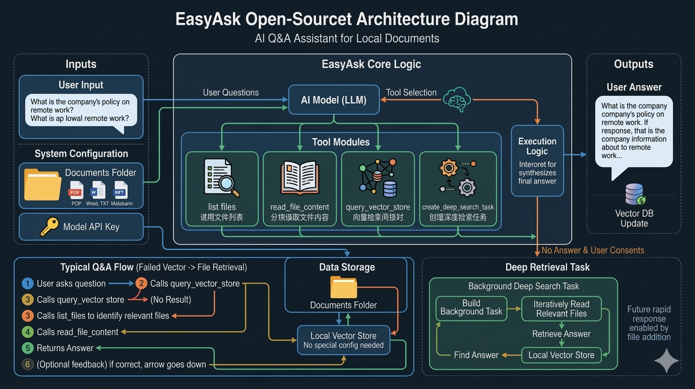

##  EasyAsk – 一键搭建你的专属知识问答助手

这是一个轻量、智能、完全开源的 AI 知识问答系统。你只需指定一个本地文件夹路径，系统就能自动将其中的文档转化为可被提问的知识库——无需复杂配置，开箱即用！

🧠 **它是怎么回答问题的？**

当用户提出一个问题时，系统会像一位认真负责的“数字研究员”一样，按以下流程一步步寻找答案：

**先查已有知识库**  
系统首先在已构建的本地向量数据库中快速检索，看看是否已有现成答案。

**浏览文件摘要**  
如果没找到，它会调用“文件列表工具”，查看文件夹里有哪些相关文档，并读取它们的摘要，缩小搜索范围。

**深入查阅具体内容**  
接着，系统会逐个打开最相关的文件，仔细阅读内容，尝试从中提取准确答案。

**实在找不到？启动深度挖掘！**  
如果多次尝试后仍无法回答，系统会主动询问用户：
> “需要我花点时间，把整个文件夹都仔细翻一遍吗？”

**后台异步深度检索**  
用户确认后，系统会启动一个后台任务，全面扫描文件夹中的所有文件，深度分析内容，努力找出答案。

**答案存入知识库，下次秒回！**  
一旦找到答案，系统会将其自动存入向量库。下次有人问类似问题，就能立刻响应，无需重复查找。

✨ **核心特性**

极简部署：只需提供一个文件夹路径，系统自动索引文档。
智能分层检索：从快到慢、从浅到深，平衡效率与准确性。
持续学习：通过深度任务不断扩充知识库，越用越聪明。

无论是团队知识库、个人笔记整理，还是技术文档问答，这个系统都能帮你把“信息海洋”变成“随问随答”的智能助手！

💡 只需一个文件夹，让 AI 帮你读懂所有文档。




```plaintext
EasyAsk 架构
├── 用户层：自然语言提问
├── 核心层：AI 模型自动选择工具
│   ├── 工具1：本地向量库检索
│   ├── 工具2：读取文件列表
│   ├── 工具3：分块读取文件内容
│   └── 工具4：后台深度检索任务
├── 存储层
│   ├── 本地文档文件夹（PDF/Word/TXT/MD）
│   └── 本地向量库（自动缓存问答对）
└── 输出层：生成回答并自动优化向量库
```

## 快速安装

### Maven 安装与运行

> **⚠️ 版本要求：**
> - Java 版本：建议 Java 21+
> - Maven 版本：建议 Maven 3.6+
>
> 请先检查版本：
> ```bash
>  java -version
>  mvn -version
> ```

1. 克隆项目
```bash
   git clone https://github.com/lvmaizi/easy-ask.git
```

2. 编译项目

```bash
   mvn clean package -DskipTests -f backend/pom.xml
```

3. 配置模型及文件夹路径
```bash
    vi ./scripts/conf/application.properties
```

4. 启动项目

```bash
    sh ./scripts/start.sh
```
```declarative
打开浏览器，访问：👉 http://localhost:8080
```
### Docker 安装与运行
1. 克隆项目
```bash
   git clone https://github.com/lvmaizi/easy-ask.git
   cd easy-ask/backend
```
2. 配置模型
```bash
    vi ./scripts/conf/application.properties
```
3. 构建镜像
```bash
    docker build -t easy-ask:latest .
```
4. 挂载文件夹启动容器
```bash
    docker run -d \
      --name easy-ask \
      -p 8080:8080 \
      -v /user/path:/app/docs \
      -e JAVA_OPTS="-Xms512m -Xmx1g -Dbase.path=/app/docs" \
      easy-ask:latest
```
```declarative
打开浏览器，访问：👉 http://localhost:8080
```

输入你的问题，Enjoy！

## 客户端试用
<table style="width: 100%">
  <tr>
    <td width="50%" align="center">
      <b>Windows</b>
    </td>
    <td width="50%" align="center">
      <b>MacOS</b>
    </td>
  </tr>
  <tr style="text-align: center">
    <td align="center" valign="middle">
      <a href='https://github.com/lvmaizi/easy-ask/releases/'>
        
        <br />
      </a>
    </td>
    <td align="center" valign="middle">
      <a href='https://github.com/lvmaizi/easy-ask/releases/'>
        
        <br />
      </a>
    </td>
  </tr>
</table>

### Windows 客户端
1. 下载客户端easy-ask.zip 文件并解压
```declarative
直接解压文件夹 easy-ask.zip即可
```

2. 配置模型及文件夹路径
```declarative
编辑配置文件 ./app/conf/application.properties 文件配置模型地址

复制文档至 ./app/docs 文件夹
```
3. 启动并访问

```declarative
启动成功后，打开浏览器，访问：👉 http://localhost:8080
```

### MacOS 客户端
1. 下载客户端easy-ask.pkg 文件并安装
```declarative
打开「系统设置」 (System Settings) -> 「隐私与安全性」 (Privacy & Security) -> 仍要打开
```
2. 配置模型及文件夹路径
```bash
  sudo vi /Applications/EasyAsk.app/Contents/app/application.properties
```
```declarative
将相关文档移动至${user.home}/easy-ask目录下
```
3. 启动并访问
```declarative
启动成功后，打开浏览器，访问：👉 http://localhost:8080
```

## 📚 案例分享

## 📄 许可证

本项目采用 MIT License — 自由使用、修改、分发，无论个人或商业用途。

## 🙌 贡献与反馈

欢迎提交 Issue、PR 或 Star 本项目！  
如果你觉得 EasyAsk 帮到了你，请点个 ⭐️ 支持开源！

GitHub: https://github.com/lvmaizi/easy-ask
作者：@lvmaizi

你的知识，值得被轻松找到。  
EasyAsk — 私有、安全、高效。
